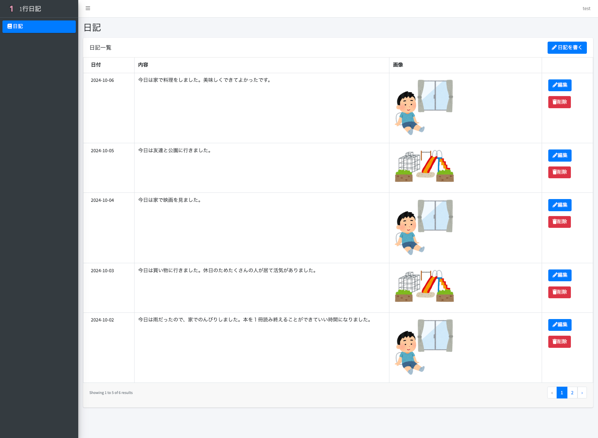
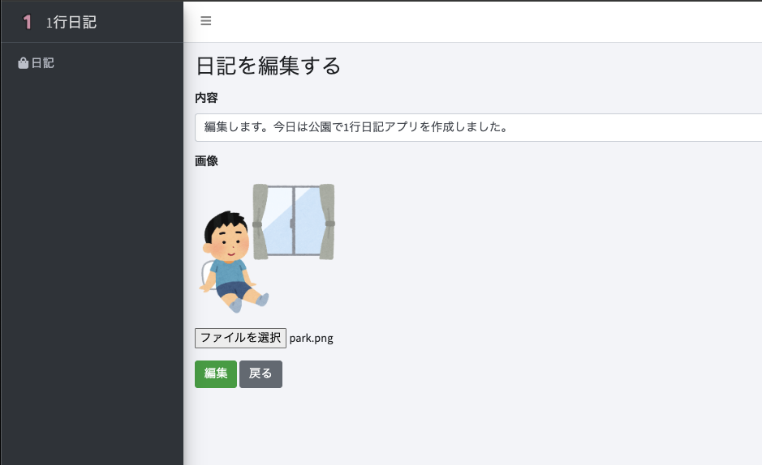

# プロジェクト名
Laravel-speedy-development
（課題用に作ったリポジトリなので名称は気にしないでください）

# デモ環境　（準備中）
https://laravel-diary-app.onrender.com

## 概要
日記アプリです。
基本的なCRUD、画像アップロード可能です。

## 主な技術スタック
- **バックエンド & フロントエンド**：Laravel 11
- **UIテンプレート**：AdminLTE
- **DB**：ローカル環境はMySQL デモ環境はPostgreSQL
- **認証機能**：Laravel Breeze
- **開発環境**：Laravel Sail (Docker)
- **デモ環境**：Render

## セットアップ手順
**注意点**: このプロジェクトは`pnpm`を使用しています。

リポジトリをローカル環境にクローン
```bash
git clone https://github.com/ohigashi-tky/Laravel-speedy-development
cd Laravel-speedy-development
```

.env作成
```bash
cp .env.example .env
```

アプリケーションキー作成
```bash
./vendor/bin/sail artisan key:generate
```

Sailを使ってDockerコンテナ起動
```bash
./vendor/bin/sail up -d
```

依存関係のインストール
```bash
./vendor/bin/sail composer install
./vendor/bin/sail pnpm install
```

マイグレーション、シーディング
```bash
./vendor/bin/sail artisan migrate --seed
```

下記にアクセスしてログイン画面が表示されればOK
http://localhost

# 画面イメージ
一覧  


登録  


登録完了  


編集  


編集完了  


削除  


削除完了  


ページネーション  
